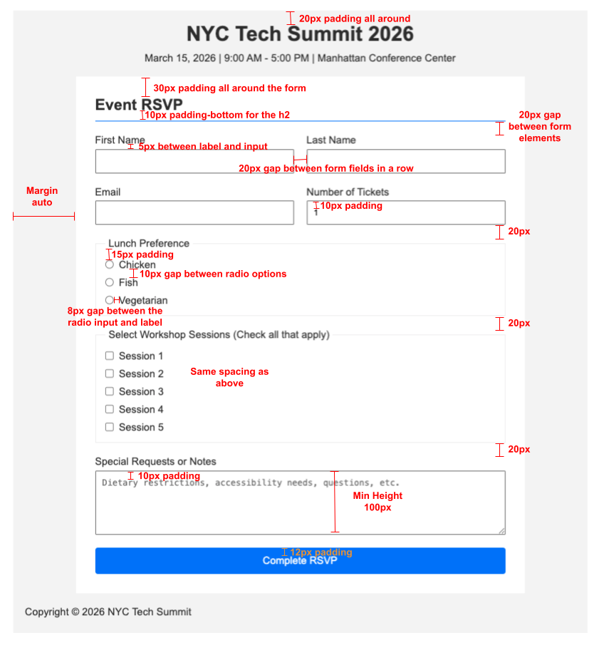

# Assignment 3-3: HTML Forms (Conference RSVP)

- [Overview](#overview)
- [Reminders](#reminders)
- [Setup](#setup)
- [Design Specifications](#design-specifications)
  - [Guiding Questions \& Suggestions](#guiding-questions--suggestions)
  - [Style Guide](#style-guide)
- [Grading Guide \& Submission](#grading-guide--submission)
  - [Technical Requirements](#technical-requirements)
  - [Submission](#submission)
- [HTML Forms Cheatsheet](#html-forms-cheatsheet)
  - [Form Structure](#form-structure)
  - [Text Inputs](#text-inputs)
  - [Radio Buttons \& Checkboxes](#radio-buttons--checkboxes)
  - [Textarea](#textarea)
  - [Submit Button](#submit-button)
  - [Labels and Accessibility](#labels-and-accessibility)
- [CSS Cheatsheet](#css-cheatsheet)
  - [Colors](#colors)
  - [Typography (Text Styling)](#typography-text-styling)
  - [Box Model (Spacing \& Sizing)](#box-model-spacing--sizing)
  - [Layout](#layout)
  - [Interactive States (Pseudo-classes)](#interactive-states-pseudo-classes)
  - [Flexbox](#flexbox)

## Overview

In this assignment, you will be building and styling a **Conference RSVP Form** using HTML forms and CSS from scratch using nothing more than a design document to reference!

This form collects attendee information including name, email, number of tickets, lunch preference, workshop session selections, and special requests.

**What's Provided:**
- Empty HTML file (`index.html`)
- CSS reset with CSS variables (`style.css`)

**Your Task:**
- Build the entire HTML form structure
- Write CSS to match the design specifications
- Use proper form elements (inputs, labels, fieldsets, etc.)
- Ensure accessibility with proper label associations

## Reminders

**<details><summary>Asking ChatGPT for Help</summary>**

If you're stuck, you may use ChatGPT to clarify the assignment — but not to solve it for you. To do this, copy the meta-prompt below into ChatGPT along with the assignment question.

> You are acting as a tutor. Your job is to explain what this coding question is asking, clarify confusing wording, and highlight the relevant concepts students need to know — but do not provide the full solution or code that directly answers the question. Instead, focus on rephrasing the problem in simpler terms, identifying what's being tested, and suggesting what steps or thought processes might help. Ask guiding questions to ensure the student is thinking critically. Do not write the final function, algorithm, or code implementation.

Be mindful of your AI usage on assignments. AI can be a great tool to help your learning but it can also be detrimental if you let it do too much of the thinking for you.

</details>

**<details><summary>Be Okay With Being "Provisionally Complete"</summary>**

At Marcy, we will deem an assignment as "complete" if you satisfy the requirements listed below. 

However, we know many of you will feel the urge to hold off on submitting until your assignment feels 100% perfect. That drive for excellence is an asset!

But perfectionism can also get in the way of learning — especially when we need to cover a lot in a short amount of time.

That's why we encourage you to be comfortable with being **"provisionally complete."** This means:

- Submitting your work even if it isn't perfect yet
- Treating submission as a checkpoint, not a finish line
- Committing to return, revise, and improve later

Learning to move forward with provisional completeness will help you make steady progress while still building the habit of continuous improvement.

</details>

## Setup

1. Create a `draft` branch.
2. Open the `src/index.html` file in your browser and set up the boilerplate (type `html:5` and hit enter)
3. Write your HTML in `src/index.html` and CSS in `src/style.css`
4. Refresh the browser frequently to see your changes

**Tips:**
- Use your browser's Developer Tools (right-click > Inspect) to debug CSS issues
- Test your form by clicking on labels — they should focus the associated input
- Make sure all form fields have proper `name` attributes for form submission

## Design Specifications

Use the spec diagram below and the following style guide to build your page. **Your goal is to perfectly match this specification down to the pixel.**



### Guiding Questions & Suggestions

Before you start coding, take a moment to analyze the design:

**HTML Structure:**
- What semantic elements can you use for the page layout? (`header`, `main`, `footer`)
- What form elements are needed? (`form`, `input`, `label`, `fieldset`, `legend`, `textarea`, `button`)
- Which inputs should be grouped together in rows?

**Form Input Types:**
- **Text inputs**: First Name, Last Name (use `type="text"`)
- **Email input**: Email (use `type="email"`)
- **Number input**: Number of Tickets (use `type="number"` with `min` and `max` attributes)
- **Radio buttons**: Lunch Preference (same `name` attribute groups them together)
- **Checkboxes**: Workshop Sessions (same `name` attribute for related checkboxes)
- **Textarea**: Special Requests or Notes

**Layout Strategy:**
- Use **Flexbox** to arrange form fields in rows
- Use **Flexbox** with `flex-direction: column` to stack form elements vertically
- Use `gap` to create consistent spacing between elements

### Style Guide

Use the following fonts and colors for this project. These are already provided as CSS variables in `style.css`:

| CSS Variable | Value | Usage |
|--------------|-------|-------|
| `--color-primary` | `#007bff` | Button background, accent borders |
| `--color-primary-dark` | `#0056b3` | Button hover state |
| `--color-background` | `#f5f5f5` | Page background |
| `--color-form-background` | `white` | Form background |
| `--color-text` | `#333` | Text color |
| `--color-border` | `#ddd` | Border color |
| `--font-family` | `Arial, sans-serif` | Font family |

**Using CSS Variables:**
```css
/* Example of using a CSS variable */
body {
  font-family: var(--font-family);
}
```

**Additional Styling Notes**

- The form should be centered on the page with a max-width of `700px`

## Grading Guide & Submission

### Technical Requirements

- [ ] Uses semantic HTML elements to structure the page
- [ ] All form inputs are present and use appropriate input types
- [ ] Every input has a label and a name attribute
- [ ] Related inputs are grouped appropriately using `fieldset`
- [ ] CSS Variables are used to minimize repetition
- [ ] Padding, margins, and gaps match the design specification
- [ ] The submit button has a hover effect
- [ ] Bonus: The form sends the form data to a formspree endpoint.

### Submission

When you are finished:
1. Save all your files
2. **Double check that you've completed the short response questions in `src/short-response.md`**
3. Commit your changes with a descriptive message
4. Push to your repository
5. Make a pull request and tag your instructors for review
6. Submit the link to your pull request

## HTML Forms Cheatsheet

Use this as a reference while working. **You don't need to memorize these!**

### Form Structure

```html
<form>
  <!-- Form elements go here -->
</form>
```

Use `<fieldset>` and `<legend>` to group related inputs:

```html
<fieldset>
  <legend>Group Title</legend>
  <!-- Related inputs here -->
</fieldset>
```

### Text Inputs

```html
<!-- Text input -->
<label for="name">Name</label>
<input type="text" id="name" name="name" required />

<!-- Email input (validates email format) -->
<label for="email">Email</label>
<input type="email" id="email" name="email" required />

<!-- Number input -->
<label for="quantity">Quantity</label>
<input type="number" id="quantity" name="quantity" min="1" max="10" value="1" />
```

### Radio Buttons & Checkboxes

**Radio buttons** (only one can be selected — use the same `name` attribute):

```html
<input type="radio" id="option1" name="choice" value="option1" />
<label for="option1">Option 1</label>

<input type="radio" id="option2" name="choice" value="option2" />
<label for="option2">Option 2</label>
```

**Checkboxes** (multiple can be selected):

```html
<input type="checkbox" id="item1" name="items" value="item1" />
<label for="item1">Item 1</label>

<input type="checkbox" id="item2" name="items" value="item2" />
<label for="item2">Item 2</label>
```

### Textarea

```html
<label for="message">Message</label>
<textarea id="message" name="message" placeholder="Enter your message..."></textarea>
```

### Submit Button

```html
<button type="submit">Submit</button>
<!-- or simply -->
<button>Submit</button>
```

### Labels and Accessibility

Always associate labels with inputs using the `for` attribute matching the input's `id`:

```html
<!-- The for attribute must match the input's id -->
<label for="email">Email</label>
<input type="email" id="email" name="email" />
```

This ensures:
- Clicking the label focuses the input
- Screen readers can announce what each input is for

## CSS Cheatsheet

### Colors

| Property | What It Does | Example |
|----------|--------------|---------|
| `color` | Sets text color | `color: var(--color-text);` |
| `background` or `background-color` | Sets background color | `background: var(--color-background);` |

### Typography (Text Styling)

| Property | What It Does | Example |
|----------|--------------|---------|
| `font-family` | Sets the font | `font-family: Arial, sans-serif;` |
| `font-size` | Sets text size (use `rem`!) | `font-size: 1rem;` |
| `font-weight` | Sets boldness | `font-weight: bold;` |
| `text-align` | Aligns text | `text-align: center;` |

### Box Model (Spacing & Sizing)

| Property | What It Does | Example |
|----------|--------------|---------|
| `width` | Sets element width | `width: 100%;` |
| `max-width` | Sets maximum width | `max-width: 700px;` |
| `min-height` | Sets minimum height | `min-height: 100px;` |
| `padding` | Space INSIDE the border | `padding: 20px;` |
| `margin` | Space OUTSIDE the border | `margin: 10px;` |
| `margin-inline` | Left and right margin | `margin-inline: auto;` |
| `border` | Creates a border | `border: 1px solid #ddd;` |
| `border-bottom` | Border on bottom only | `border-bottom: 1px solid blue;` |
| `border-radius` | Rounds corners | `border-radius: 4px;` |

### Layout

| Property | What It Does | Example |
|----------|--------------|---------|
| `margin-inline: auto` | Centers a block element | `margin-inline: auto;` |

### Interactive States (Pseudo-classes)

```css
/* When mouse hovers over element */
button:hover {
  background-color: var(--color-primary-dark);
}
```

### Flexbox

| Property | What It Does | Example |
|----------|--------------|---------|
| `display: flex` | Makes the element a flex container | `display: flex;` |
| `flex-direction` | Sets direction: `row` (default), `column` | `flex-direction: column;` |
| `justify-content` | Spacing along the **main axis** | `justify-content: center;` |
| `align-items` | Alignment along the **cross axis** | `align-items: center;` |
| `gap` | Space **between** flex items | `gap: 20px;` |
| `flex: 1` | Makes item grow to fill available space | `flex: 1;` |

